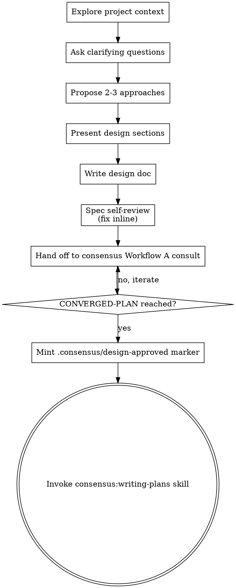

<!-- Vendored from Superpowers (c) 2025 Jesse Vincent, github.com/obra/superpowers, v5.1.0 @ f2cbfbe, MIT. Adapted for consensus-mcp. -->
---
name: consensus-brainstorming
description: "Consensus-adapted: You MUST use this before any creative work - creating features, building components, adding functionality, or modifying behavior. Explores user intent, requirements and design before implementation, then hands off to a consensus Workflow A consult for approval."
---

# Brainstorming Ideas Into Designs

> Consensus has precedence at decision gates (see the consensus bootstrap / consensus-workflow).

Help turn ideas into fully formed designs and specs through natural collaborative dialogue.

Start by understanding the current project context, then ask questions one at a time to refine the idea. Once you understand what you're building, present the design and hand it off to a consensus Workflow A consult - **consensus is the approver, not the user.**

<HARD-GATE>
Do NOT invoke any implementation skill, write any code, scaffold any project, or take any implementation action until the design has been handed off to a consensus Workflow A consult AND a CONVERGED-PLAN has been reached. The CONVERGED-PLAN is the approval. This applies to EVERY project regardless of perceived simplicity.
</HARD-GATE>

## Anti-Pattern: "This Is Too Simple To Need A Design"

Every project goes through this process. A todo list, a single-function utility, a config change - all of them. "Simple" projects are where unexamined assumptions cause the most wasted work. The design can be short (a few sentences for truly simple projects), but you MUST present it and route it through the consensus consult.

## Checklist

You MUST create a task for each of these items and complete them in order:

1. **Explore project context** - check files, docs, recent commits
2. **Ask clarifying questions** - one at a time, understand purpose/constraints/success criteria
3. **Propose 2-3 approaches** - with trade-offs and your recommendation
4. **Present design** - in sections scaled to their complexity
5. **Write design doc** - save to `docs/consensus/specs/YYYY-MM-DD-<topic>-design.md` and commit
6. **Spec self-review** - quick inline check for placeholders, contradictions, ambiguity, scope (see below)
7. **Hand off to a consensus Workflow A consult** - the CONVERGED-PLAN is the approval (see Consensus Hand-Off below)
8. **On convergence: mint `.consensus/design-approved` and transition to implementation** - invoke `consensus:writing-plans`

## Process Flow

**The terminal state is invoking consensus:writing-plans (after the consensus consult converges).** Do NOT invoke frontend-design, mcp-builder, or any other implementation skill. The ONLY skill you invoke after brainstorming is consensus:writing-plans.

## The Process

**Understanding the idea:**

- Check out the current project state first (files, docs, recent commits)
- Before asking detailed questions, assess scope: if the request describes multiple independent subsystems (e.g., "build a platform with chat, file storage, billing, and analytics"), flag this immediately. Don't spend questions refining details of a project that needs to be decomposed first.
- If the project is too large for a single spec, help the user decompose into sub-projects: what are the independent pieces, how do they relate, what order should they be built? Then brainstorm the first sub-project through the normal design flow. Each sub-project gets its own spec -> plan -> implementation cycle.
- For appropriately-scoped projects, ask questions one at a time to refine the idea
- Prefer multiple choice questions when possible, but open-ended is fine too
- Only one question per message - if a topic needs more exploration, break it into multiple questions
- Focus on understanding: purpose, constraints, success criteria

**Exploring approaches:**

- Propose 2-3 different approaches with trade-offs
- Present options conversationally with your recommendation and reasoning
- Lead with your recommended option and explain why

**Presenting the design:**

- Once you believe you understand what you're building, present the design
- Scale each section to its complexity: a few sentences if straightforward, up to 200-300 words if nuanced
- Cover: architecture, components, data flow, error handling, testing
- Be ready to go back and clarify if something doesn't make sense

**Design for isolation and clarity:**

- Break the system into smaller units that each have one clear purpose, communicate through well-defined interfaces, and can be understood and tested independently
- For each unit, you should be able to answer: what does it do, how do you use it, and what does it depend on?
- Can someone understand what a unit does without reading its internals? Can you change the internals without breaking consumers? If not, the boundaries need work.
- Smaller, well-bounded units are also easier for you to work with - you reason better about code you can hold in context at once, and your edits are more reliable when files are focused. When a file grows large, that's often a signal that it's doing too much.

**Working in existing codebases:**

- Explore the current structure before proposing changes. Follow existing patterns.
- Where existing code has problems that affect the work (e.g., a file that's grown too large, unclear boundaries, tangled responsibilities), include targeted improvements as part of the design - the way a good developer improves code they're working in.
- Don't propose unrelated refactoring. Stay focused on what serves the current goal.

## After the Design

**Documentation:**

- Write the validated design (spec) to `docs/consensus/specs/YYYY-MM-DD-<topic>-design.md`
  - (User preferences for spec location override this default)
- Write the spec clearly and concisely
- Commit the design document to git

**Spec Self-Review:**
After writing the spec document, look at it with fresh eyes:

1. **Placeholder scan:** Any "TBD", "TODO", incomplete sections, or vague requirements? Fix them.
2. **Internal consistency:** Do any sections contradict each other? Does the architecture match the feature descriptions?
3. **Scope check:** Is this focused enough for a single implementation plan, or does it need decomposition?
4. **Ambiguity check:** Could any requirement be interpreted two different ways? If so, pick one and make it explicit.

Fix any issues inline. No need to re-review - just fix and move on.

## Consensus Hand-Off (the approval gate)

This is the consensus-adapted terminal gate. **Do NOT "present the design and get USER approval" as the terminal step. Instead:**

> **Hand off to a consensus Workflow A consult (see consensus-workflow).** The CONVERGED-PLAN is the approval - **consensus is the approver, not the user.** On convergence, mint the `.consensus/design-approved` marker (YAML fields: `iteration_id`, `scope_glob`, `converged_plan_sha256`, `sealed_at_utc`), then invoke `consensus:writing-plans`.

Steps:

1. **Dispatch the consult.** Run the design through a consensus Workflow A consult (propose-converge, blind-first-reveal, cross-family panel). The design spec you just wrote is the input; the consult produces a CONVERGED-PLAN.
2. **Treat the CONVERGED-PLAN as the approval.** Do not ask the user "do you approve?" - the cross-family seal on the converged plan IS the approval. The user is a participant in the consult, not the sole gate.
3. **Mint the `.consensus/design-approved` marker.** On convergence, write `.consensus/design-approved` with these YAML fields:
   - `iteration_id` - the consensus iteration that produced the converged plan
   - `scope_glob` - the glob of paths this design is approved to touch (e.g. `src/**`)
   - `converged_plan_sha256` - the sha256 of the sealed converged-plan
   - `sealed_at_utc` - the UTC timestamp the marker was sealed

   This marker is consumed by a PreToolUse hook (built separately) that blocks Edit/Write outside `scope_glob` until a valid, cross-family-sealed marker exists. A single-Claude-only marker is treated as advisory (NOT approved) by that gate.
4. **Invoke `consensus:writing-plans`.** After the marker is minted, the next (and only) skill is `consensus:writing-plans`. Do NOT invoke any other implementation skill.

## Key Principles

- **One question at a time** - Don't overwhelm with multiple questions
- **Multiple choice preferred** - Easier to answer than open-ended when possible
- **YAGNI ruthlessly** - Remove unnecessary features from all designs
- **Explore alternatives** - Always propose 2-3 approaches before settling
- **Consensus is the approver** - the CONVERGED-PLAN, not a user "yes", is the gate
- **Be flexible** - Go back and clarify when something doesn't make sense

_(The upstream Superpowers "Visual Companion" - a browser-based mockup server - was
intentionally NOT vendored: it is out of scope for consensus-mcp, a cross-AI code-
review tool. Brainstorm visually in text; describe diagrams/layouts in prose.)_
